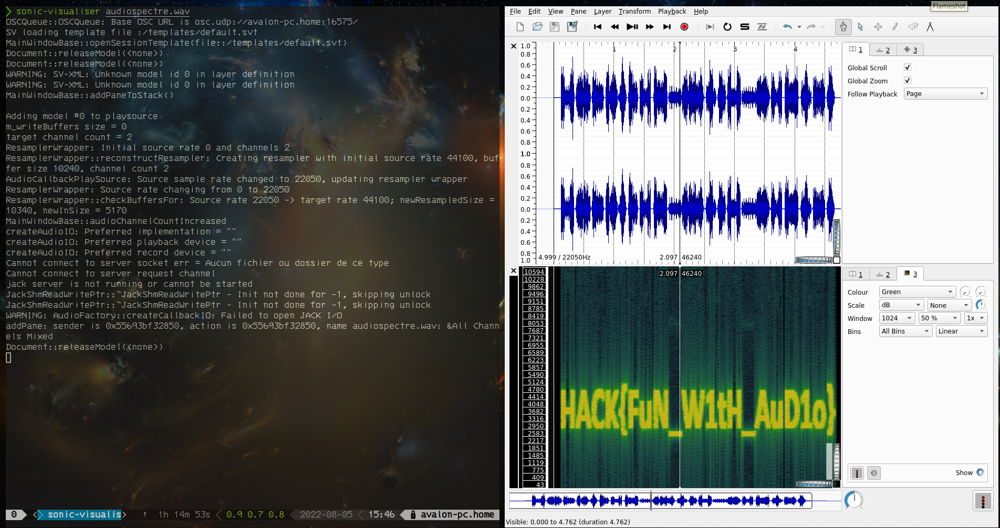

# AUDIOSPECTRE

## 0x1 : tldr

La solution est cachée dans le spectrograme de l'audio.  Avec l'outil de votre choix (audio sonic, audacity,…) vous pouvez révéler le flag.

## 0x2: sonic-visualizer

Ouvrez le fichier dans sonic-visualizer, puis dans l'option **Pane** allez dans **Add Spectogram** puis **All channel mixed**

l'affichage changera alors de la façon suivante:

le flag est donc:
>HACK{FuN_W1tH_AuD1o}
