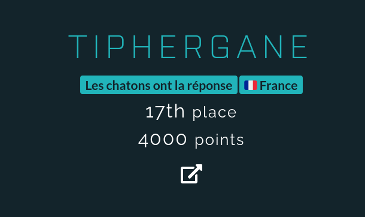

# Opération Kernel 3.0

## Présentation

L'opération Kernel 3.0 est le CTF organisé par le **COS** (Commandement des Opérations Spéciales), pour ses 30 ans.

Il sagit d'un CTF Geopardy accompagné d'un Escape Game virtuel créé par [succubus interactive](https://www.succubus.fr) qui s'est déroulé du 27 juin au 14 juillet 2022.

## À propos de moi

Vous commencez à me connaitre désormais, et pour les nouveaux qui arrivent sur mon github, je vous souhaite la bienvenue à tous.

Plus totalement un débutant sur les CTF, mais pas encore assez fort pour être un pro, j'ai beaucoup appris depuis le FCSC 2020.

## Résultat

Les write-ups ne sont pas encore prêt, mais je vais essayer de les faire assez rapidement.

Vous trouverez tout de même ici même les flags et les scripts (pour SQL 3 par exemple) que j'ai utilisé durant la compétition.

## Remerciements

Merci à [Aku](https://twitter.com/Akumarachi) d'avoir préparé ce CTF et d'avoir fait ce qu'il fallait pour maintenir les serveurs durant la période.
Merci aussi au COS d'avoir initié ce tournois, et merci à tous les participants pour ces bons moments passé à chercher les flags.
